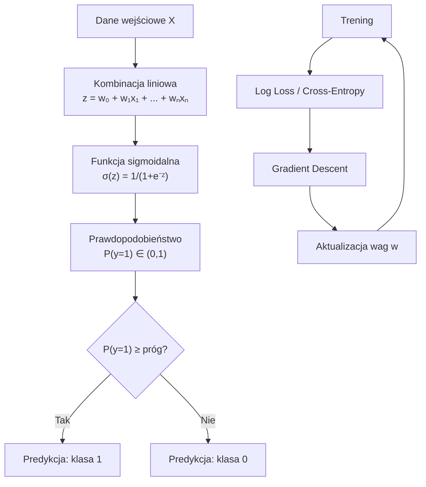
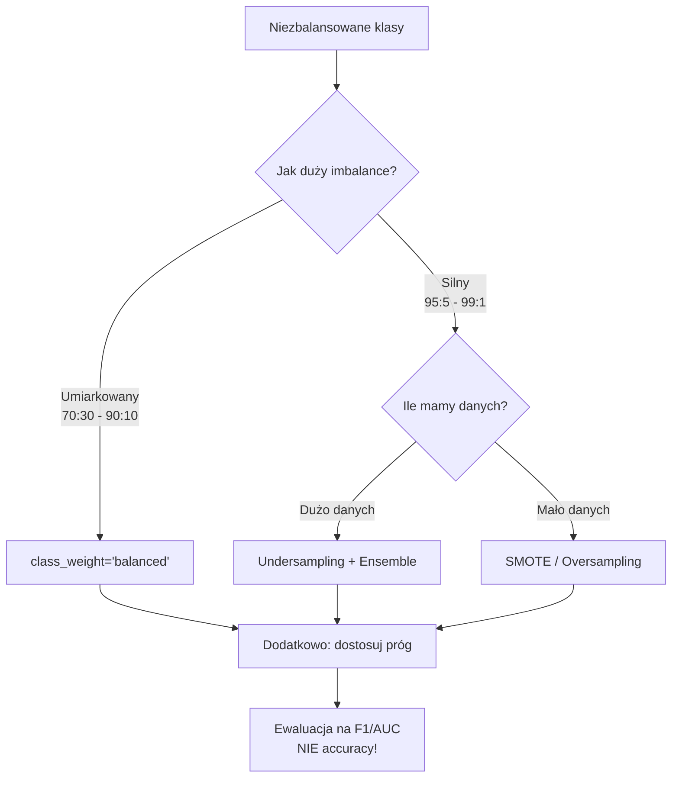

# **Lekcja 21: Regresja logistyczna i klasyfikacja**

`#lekcja` `#datascience` `#machine-learning` `#klasyfikacja` `#regresja-logistyczna` `#metryki` `#balans-klas`

W tej lekcji poznasz **regresję logistyczną** – jeden z najważniejszych algorytmów klasyfikacji w Machine Learning. Nauczysz się, jak model przekształca wynik liniowy w prawdopodobieństwo, jakie metryki stosować do oceny klasyfikatorów oraz jak radzić sobie z problemem niezbalansowanych klas.

---

## **1. Regresja logistyczna – podstawy**

> [!definition]
> **Regresja logistyczna** to algorytm uczenia nadzorowanego służący do **klasyfikacji binarnej** (i wieloklasowej). Mimo nazwy "regresja", jest to model klasyfikacyjny, który przewiduje **prawdopodobieństwo** przynależności do klasy.

### Wprowadzenie

Regresja logistyczna łączy regresję liniową z funkcją **sigmoidalną** (logistyczną), która przekształca dowolną wartość rzeczywistą w prawdopodobieństwo z zakresu (0, 1).

**Równanie regresji logistycznej:**

$$P(y=1|X) = \sigma(w_0 + w_1x_1 + w_2x_2 + ... + w_nx_n)$$

gdzie funkcja sigmoidalna:

$$\sigma(z) = \frac{1}{1 + e^{-z}}$$

### Przykład 1: Funkcja sigmoidalna - wizualizacja

```python
# Wizualizacja funkcji sigmoidalnej
import numpy as np
import matplotlib.pyplot as plt

# Funkcja sigmoidalna
def sigmoid(z):
    """
    Funkcja sigmoidalna: σ(z) = 1 / (1 + e^(-z))
    Przekształca dowolną wartość w zakres (0, 1)
    """
    return 1 / (1 + np.exp(-z))

# Generujemy wartości z od -10 do 10
z = np.linspace(-10, 10, 200)

# Obliczamy wartości sigmoidy
p = sigmoid(z)

# Wizualizacja
plt.figure(figsize=(10, 6))
plt.plot(z, p, 'b-', linewidth=2, label='σ(z) = 1 / (1 + e^(-z))')
plt.axhline(y=0.5, color='r', linestyle='--', alpha=0.7, label='Próg decyzyjny (0.5)')
plt.axhline(y=0, color='gray', linestyle='-', alpha=0.3)
plt.axhline(y=1, color='gray', linestyle='-', alpha=0.3)
plt.axvline(x=0, color='gray', linestyle='-', alpha=0.3)

# Zaznaczenie kluczowych punktów
plt.scatter([0], [0.5], color='red', s=100, zorder=5)
plt.annotate('σ(0) = 0.5', xy=(0, 0.5), xytext=(2, 0.6),
             fontsize=12, arrowprops=dict(arrowstyle='->', color='red'))

plt.xlabel('z (wartość liniowa)', fontsize=12)
plt.ylabel('σ(z) (prawdopodobieństwo)', fontsize=12)
plt.title('Funkcja sigmoidalna - przekształca z → P(y=1)', fontsize=14)
plt.legend(loc='upper left')
plt.grid(True, alpha=0.3)
plt.xlim(-10, 10)
plt.ylim(-0.05, 1.05)
plt.tight_layout()
plt.savefig('sigmoid.png', dpi=100)
plt.show()

# Interpretacja wartości sigmoidy
print("Interpretacja wartości sigmoidy:")
print(f"σ(-5) = {sigmoid(-5):.4f} → klasa 0")
print(f"σ(-2) = {sigmoid(-2):.4f} → klasa 0")
print(f"σ(0)  = {sigmoid(0):.4f} → granica decyzyjna")
print(f"σ(2)  = {sigmoid(2):.4f} → klasa 1")
print(f"σ(5)  = {sigmoid(5):.4f} → klasa 1")
```

### Przykład 2: Trening regresji logistycznej na Breast Cancer dataset

```python
# Klasyfikacja binarna: wykrywanie raka piersi
import numpy as np
import pandas as pd
from sklearn.datasets import load_breast_cancer
from sklearn.model_selection import train_test_split
from sklearn.preprocessing import StandardScaler
from sklearn.linear_model import LogisticRegression
from sklearn.metrics import accuracy_score, classification_report

# Wczytanie danych
data = load_breast_cancer()
X = data.data
y = data.target  # 0 = złośliwy (malignant), 1 = łagodny (benign)

# Konwersja do DataFrame dla lepszej eksploracji
df = pd.DataFrame(X, columns=data.feature_names)
df['target'] = y

print("Rozmiar danych:", X.shape)
print(f"Liczba cech: {X.shape[1]}")
print(f"\nRozkład klas:")
print(pd.Series(y).value_counts().rename({0: 'Złośliwy', 1: 'Łagodny'}))

# Podział na train/test (stratyfikowany!)
X_train, X_test, y_train, y_test = train_test_split(
    X, y,
    test_size=0.2,
    random_state=42,
    stratify=y  # Zachowuje proporcje klas
)

print(f"\nRozmiar treningowy: {X_train.shape[0]}")
print(f"Rozmiar testowy: {X_test.shape[0]}")

# Standaryzacja cech (ważne dla regresji logistycznej!)
scaler = StandardScaler()
X_train_scaled = scaler.fit_transform(X_train)  # fit_transform na train
X_test_scaled = scaler.transform(X_test)         # tylko transform na test

# Trening modelu regresji logistycznej
model = LogisticRegression(
    max_iter=1000,     # Maksymalna liczba iteracji
    random_state=42
)
model.fit(X_train_scaled, y_train)

# Predykcja
y_pred = model.predict(X_test_scaled)

# Ocena modelu
accuracy = accuracy_score(y_test, y_pred)
print(f"\n=== WYNIKI ===")
print(f"Accuracy: {accuracy:.4f} ({accuracy*100:.2f}%)")

print("\nClassification Report:")
print(classification_report(y_test, y_pred,
                            target_names=['Złośliwy', 'Łagodny']))
```

### Przykład 3: Predykcja prawdopodobieństw i próg decyzyjny

```python
# Predykcja prawdopodobieństw zamiast klas
import numpy as np
import matplotlib.pyplot as plt
from sklearn.linear_model import LogisticRegression
from sklearn.datasets import load_breast_cancer
from sklearn.model_selection import train_test_split
from sklearn.preprocessing import StandardScaler

# Przygotowanie danych (jak wyżej)
data = load_breast_cancer()
X_train, X_test, y_train, y_test = train_test_split(
    data.data, data.target, test_size=0.2, random_state=42, stratify=data.target
)
scaler = StandardScaler()
X_train_scaled = scaler.fit_transform(X_train)
X_test_scaled = scaler.transform(X_test)

# Trening modelu
model = LogisticRegression(max_iter=1000, random_state=42)
model.fit(X_train_scaled, y_train)

# predict_proba() zwraca prawdopodobieństwa dla każdej klasy
y_proba = model.predict_proba(X_test_scaled)

# y_proba ma kształt (n_samples, n_classes)
# Kolumna 0: P(y=0), Kolumna 1: P(y=1)
print("Kształt y_proba:", y_proba.shape)
print("\nPrzykładowe prawdopodobieństwa (pierwszych 10 obserwacji):")
print("P(złośliwy)  P(łagodny)  Predykcja  Prawda")
print("-" * 50)
for i in range(10):
    pred = 1 if y_proba[i, 1] >= 0.5 else 0
    print(f"{y_proba[i, 0]:.4f}       {y_proba[i, 1]:.4f}       {pred}          {y_test[i]}")

# Wizualizacja rozkładu prawdopodobieństw
plt.figure(figsize=(12, 5))

# Subplot 1: Histogram prawdopodobieństw
plt.subplot(1, 2, 1)
plt.hist(y_proba[y_test == 0, 1], bins=20, alpha=0.7, label='Złośliwy (0)', color='red')
plt.hist(y_proba[y_test == 1, 1], bins=20, alpha=0.7, label='Łagodny (1)', color='green')
plt.axvline(x=0.5, color='black', linestyle='--', label='Próg 0.5')
plt.xlabel('P(y=1) - Prawdopodobieństwo klasy łagodnej')
plt.ylabel('Liczba obserwacji')
plt.title('Rozkład prawdopodobieństw per klasa')
plt.legend()

# Subplot 2: Scatter plot z kolorami
plt.subplot(1, 2, 2)
colors = ['red' if y == 0 else 'green' for y in y_test]
plt.scatter(range(len(y_proba)), y_proba[:, 1], c=colors, alpha=0.6)
plt.axhline(y=0.5, color='black', linestyle='--', label='Próg 0.5')
plt.xlabel('Indeks obserwacji')
plt.ylabel('P(y=1)')
plt.title('Prawdopodobieństwa dla próbek testowych')
plt.legend()

plt.tight_layout()
plt.savefig('proba_distribution.png', dpi=100)
plt.show()

# Eksperyment z różnymi progami decyzyjnymi
print("\n=== WPŁYW PROGU DECYZYJNEGO ===")
thresholds = [0.3, 0.5, 0.7]
for thresh in thresholds:
    y_pred_custom = (y_proba[:, 1] >= thresh).astype(int)
    acc = (y_pred_custom == y_test).mean()
    print(f"Próg {thresh}: Accuracy = {acc:.4f}")
```

### Schemat działania regresji logistycznej



> [!tip]
> **Standaryzacja jest kluczowa** dla regresji logistycznej. Model używa gradient descent do optymalizacji - cechy o różnych skalach mogą powodować wolną konwergencję. Zawsze używaj `StandardScaler` lub `MinMaxScaler` przed treningiem.

> [!warning]
> **Nigdy nie używaj `fit_transform()` na danych testowych!** To powoduje data leakage. Scaler musi być dopasowany (`fit`) TYLKO na danych treningowych, a następnie użyty (`transform`) na obu zbiorach.

---

## **2. Metryki klasyfikacji**

> [!definition]
> **Metryki klasyfikacji** to miary oceny jakości modeli klasyfikacyjnych. W przeciwieństwie do regresji, gdzie mierzymy błąd liczbowy, w klasyfikacji liczymy poprawne i niepoprawne przypisania do klas.

### Wprowadzenie

Podstawowe metryki opierają się na **macierzy pomyłek (Confusion Matrix)**:

|                | Predicted: 0 | Predicted: 1 |
|----------------|--------------|--------------|
| **Actual: 0**  | TN (True Negative) | FP (False Positive) |
| **Actual: 1**  | FN (False Negative) | TP (True Positive) |

- **TP** (True Positive): Poprawnie przewidziana klasa pozytywna
- **TN** (True Negative): Poprawnie przewidziana klasa negatywna
- **FP** (False Positive): Błędnie przewidziana jako pozytywna (błąd typu I)
- **FN** (False Negative): Błędnie przewidziana jako negatywna (błąd typu II)

### Przykład 1: Confusion Matrix i podstawowe metryki

```python
# Wizualizacja i interpretacja Confusion Matrix
import numpy as np
import matplotlib.pyplot as plt
import seaborn as sns
from sklearn.datasets import load_breast_cancer
from sklearn.model_selection import train_test_split
from sklearn.preprocessing import StandardScaler
from sklearn.linear_model import LogisticRegression
from sklearn.metrics import (confusion_matrix, accuracy_score,
                             precision_score, recall_score, f1_score)

# Przygotowanie danych i trening modelu
data = load_breast_cancer()
X_train, X_test, y_train, y_test = train_test_split(
    data.data, data.target, test_size=0.2, random_state=42, stratify=data.target
)
scaler = StandardScaler()
X_train_scaled = scaler.fit_transform(X_train)
X_test_scaled = scaler.transform(X_test)

model = LogisticRegression(max_iter=1000, random_state=42)
model.fit(X_train_scaled, y_train)
y_pred = model.predict(X_test_scaled)

# Confusion Matrix
cm = confusion_matrix(y_test, y_pred)
print("Confusion Matrix:")
print(cm)
print()

# Wyciągamy wartości TP, TN, FP, FN
tn, fp, fn, tp = cm.ravel()
print(f"True Negatives (TN):  {tn} - poprawnie wykryte złośliwe")
print(f"False Positives (FP): {fp} - złośliwe błędnie uznane za łagodne")
print(f"False Negatives (FN): {fn} - łagodne błędnie uznane za złośliwe")
print(f"True Positives (TP):  {tp} - poprawnie wykryte łagodne")

# Obliczenie metryk "ręcznie"
accuracy_manual = (tp + tn) / (tp + tn + fp + fn)
precision_manual = tp / (tp + fp)
recall_manual = tp / (tp + fn)
f1_manual = 2 * (precision_manual * recall_manual) / (precision_manual + recall_manual)

print(f"\n=== METRYKI (obliczone ręcznie) ===")
print(f"Accuracy:  {accuracy_manual:.4f} - % poprawnych predykcji")
print(f"Precision: {precision_manual:.4f} - % prawdziwych pozytywnych wśród przewidzianych")
print(f"Recall:    {recall_manual:.4f} - % wykrytych prawdziwych pozytywnych")
print(f"F1-score:  {f1_manual:.4f} - średnia harmoniczna precision i recall")

# Porównanie z sklearn
print(f"\n=== METRYKI (sklearn) ===")
print(f"Accuracy:  {accuracy_score(y_test, y_pred):.4f}")
print(f"Precision: {precision_score(y_test, y_pred):.4f}")
print(f"Recall:    {recall_score(y_test, y_pred):.4f}")
print(f"F1-score:  {f1_score(y_test, y_pred):.4f}")

# Wizualizacja Confusion Matrix
plt.figure(figsize=(10, 4))

# Subplot 1: Wartości bezwzględne
plt.subplot(1, 2, 1)
sns.heatmap(cm, annot=True, fmt='d', cmap='Blues',
            xticklabels=['Złośliwy (0)', 'Łagodny (1)'],
            yticklabels=['Złośliwy (0)', 'Łagodny (1)'])
plt.xlabel('Predykcja')
plt.ylabel('Prawda')
plt.title('Confusion Matrix (wartości)')

# Subplot 2: Znormalizowane (procenty)
cm_normalized = cm.astype('float') / cm.sum(axis=1)[:, np.newaxis]
plt.subplot(1, 2, 2)
sns.heatmap(cm_normalized, annot=True, fmt='.2%', cmap='Blues',
            xticklabels=['Złośliwy (0)', 'Łagodny (1)'],
            yticklabels=['Złośliwy (0)', 'Łagodny (1)'])
plt.xlabel('Predykcja')
plt.ylabel('Prawda')
plt.title('Confusion Matrix (znormalizowane)')

plt.tight_layout()
plt.savefig('confusion_matrix.png', dpi=100)
plt.show()
```

### Przykład 2: Krzywa ROC i AUC

```python
# Krzywa ROC (Receiver Operating Characteristic) i AUC
import numpy as np
import matplotlib.pyplot as plt
from sklearn.datasets import load_breast_cancer
from sklearn.model_selection import train_test_split
from sklearn.preprocessing import StandardScaler
from sklearn.linear_model import LogisticRegression
from sklearn.metrics import roc_curve, roc_auc_score, auc

# Przygotowanie danych
data = load_breast_cancer()
X_train, X_test, y_train, y_test = train_test_split(
    data.data, data.target, test_size=0.2, random_state=42, stratify=data.target
)
scaler = StandardScaler()
X_train_scaled = scaler.fit_transform(X_train)
X_test_scaled = scaler.transform(X_test)

# Trening modelu
model = LogisticRegression(max_iter=1000, random_state=42)
model.fit(X_train_scaled, y_train)

# Predykcja prawdopodobieństw (potrzebna dla ROC)
y_proba = model.predict_proba(X_test_scaled)[:, 1]

# Obliczenie krzywej ROC
# fpr = False Positive Rate = FP / (FP + TN)
# tpr = True Positive Rate = TP / (TP + FN) = Recall
fpr, tpr, thresholds = roc_curve(y_test, y_proba)

# Obliczenie AUC (Area Under Curve)
roc_auc = roc_auc_score(y_test, y_proba)

print(f"AUC (Area Under ROC Curve): {roc_auc:.4f}")
print(f"\nInterpretacja AUC:")
print(f"  0.5 = losowy klasyfikator (bezużyteczny)")
print(f"  0.7-0.8 = akceptowalny")
print(f"  0.8-0.9 = dobry")
print(f"  0.9-1.0 = bardzo dobry")
print(f"  1.0 = idealny")

# Wizualizacja krzywej ROC
plt.figure(figsize=(10, 5))

# Subplot 1: Krzywa ROC
plt.subplot(1, 2, 1)
plt.plot(fpr, tpr, color='blue', lw=2,
         label=f'ROC curve (AUC = {roc_auc:.4f})')
plt.plot([0, 1], [0, 1], color='red', linestyle='--', lw=2,
         label='Losowy klasyfikator (AUC = 0.5)')
plt.fill_between(fpr, tpr, alpha=0.2, color='blue')
plt.xlabel('False Positive Rate (1 - Specificity)')
plt.ylabel('True Positive Rate (Recall / Sensitivity)')
plt.title('Krzywa ROC')
plt.legend(loc='lower right')
plt.grid(True, alpha=0.3)

# Subplot 2: Próg decyzyjny vs metryki
plt.subplot(1, 2, 2)
# Pomijamy pierwszy element thresholds (np.inf), aby wykres był czytelny
plt.plot(thresholds[1:], tpr[1:], label='Recall (TPR)', color='blue')
plt.plot(thresholds[1:], 1 - fpr[1:], label='Specificity (1-FPR)', color='green')
plt.xlabel('Próg decyzyjny')
plt.ylabel('Wartość metryki')
plt.title('Metryki vs próg decyzyjny')
plt.legend()
plt.grid(True, alpha=0.3)
plt.xlim([0, 1])

plt.tight_layout()
plt.savefig('roc_curve.png', dpi=100)
plt.show()

# Znalezienie optymalnego progu (punkt najbliższy do (0, 1))
optimal_idx = np.argmax(tpr - fpr)
optimal_threshold = thresholds[optimal_idx]
print(f"\nOptymalny próg decyzyjny: {optimal_threshold:.4f}")
print(f"Przy tym progu: TPR = {tpr[optimal_idx]:.4f}, FPR = {fpr[optimal_idx]:.4f}")
```

### Przykład 3: Precision-Recall curve

```python
# Krzywa Precision-Recall (ważna dla niezbalansowanych klas)
import numpy as np
import matplotlib.pyplot as plt
from sklearn.datasets import load_breast_cancer
from sklearn.model_selection import train_test_split
from sklearn.preprocessing import StandardScaler
from sklearn.linear_model import LogisticRegression
from sklearn.metrics import precision_recall_curve, average_precision_score

# Przygotowanie danych
data = load_breast_cancer()
X_train, X_test, y_train, y_test = train_test_split(
    data.data, data.target, test_size=0.2, random_state=42, stratify=data.target
)
scaler = StandardScaler()
X_train_scaled = scaler.fit_transform(X_train)
X_test_scaled = scaler.transform(X_test)

# Trening
model = LogisticRegression(max_iter=1000, random_state=42)
model.fit(X_train_scaled, y_train)
y_proba = model.predict_proba(X_test_scaled)[:, 1]

# Obliczenie krzywej Precision-Recall
precision, recall, thresholds_pr = precision_recall_curve(y_test, y_proba)

# Average Precision (AP) - pole pod krzywą PR
ap = average_precision_score(y_test, y_proba)

print(f"Average Precision (AP): {ap:.4f}")

# Wizualizacja
plt.figure(figsize=(12, 5))

# Subplot 1: Krzywa PR
plt.subplot(1, 2, 1)
plt.plot(recall, precision, color='purple', lw=2,
         label=f'PR curve (AP = {ap:.4f})')
plt.fill_between(recall, precision, alpha=0.2, color='purple')
plt.xlabel('Recall')
plt.ylabel('Precision')
plt.title('Krzywa Precision-Recall')
plt.legend(loc='lower left')
plt.grid(True, alpha=0.3)

# Subplot 2: Precision i Recall vs próg
plt.subplot(1, 2, 2)
plt.plot(thresholds_pr, precision[:-1], label='Precision', color='blue')
plt.plot(thresholds_pr, recall[:-1], label='Recall', color='red')
plt.xlabel('Próg decyzyjny')
plt.ylabel('Wartość metryki')
plt.title('Precision i Recall vs próg')
plt.legend()
plt.grid(True, alpha=0.3)

plt.tight_layout()
plt.savefig('precision_recall_curve.png', dpi=100)
plt.show()

# Trade-off Precision-Recall
print("\n=== TRADE-OFF PRECISION-RECALL ===")
print("Wyższy próg → wyższa Precision, niższy Recall")
print("Niższy próg → wyższy Recall, niższa Precision")
print("\nKiedy co preferować?")
print("- Wysoka Precision: gdy FP jest kosztowne (spam filter)")
print("- Wysoki Recall: gdy FN jest kosztowne (wykrywanie raka)")
```

### Wizualizacja zależności między metrykami

```mermaid
graph LR
    subgraph "Confusion Matrix"
        TN[TN] --> Spec[Specificity<br/>TN/(TN+FP)]
        FP[FP] --> Spec
        FN[FN] --> Rec[Recall<br/>TP/(TP+FN)]
        TP[TP] --> Rec
        TP --> Prec[Precision<br/>TP/(TP+FP)]
        FP --> Prec
    end

    Prec --> F1[F1-Score<br/>2×Prec×Rec/(Prec+Rec)]
    Rec --> F1
    Rec --> ROC[ROC Curve<br/>TPR vs FPR]
    Spec --> ROC
    Prec --> PR[PR Curve<br/>Precision vs Recall]
    Rec --> PR
```

> [!note]
> **Kiedy używać której metryki?**
> - **Accuracy**: Zbalansowane klasy, równy koszt błędów
> - **Precision**: Minimalizacja fałszywych pozytywów (spam, fraud detection)
> - **Recall**: Minimalizacja fałszywych negatywów (diagnostyka medyczna)
> - **F1-score**: Kompromis między Precision i Recall
> - **AUC-ROC**: Ogólna jakość klasyfikatora, niezależnie od progu

> [!warning]
> **Accuracy może być myląca** przy niezbalansowanych klasach! Jeśli 95% próbek to klasa 0, model "zawsze przewidujący 0" ma 95% accuracy, ale jest bezużyteczny. W takich przypadkach używaj Precision, Recall, F1 lub AUC.

---

## **3. Problem niezbalansowanych klas**

> [!definition]
> **Niezbalansowane klasy** (class imbalance) występują, gdy jedna klasa ma znacznie więcej obserwacji niż inna. Typowe proporcje to 90:10, 99:1 lub nawet 99.9:0.1. Przykłady: wykrywanie oszustw, diagnostyka rzadkich chorób, wykrywanie spamu.

### Wprowadzenie

Problem niezbalansowanych klas jest jednym z najczęstszych wyzwań w praktyce ML. Model trenowany na niezbalansowanych danych ma tendencję do "faworyzowania" klasy dominującej.

**Strategie radzenia sobie z imbalance:**
1. **Undersampling** - usunięcie części próbek z klasy dominującej
2. **Oversampling** - duplikacja lub generowanie próbek klasy mniejszościowej
3. **SMOTE** - syntetyczna generacja nowych próbek mniejszości
4. **Wagi klas** - nadanie wyższej wagi próbkom z klasy mniejszościowej
5. **Zmiana progu decyzyjnego** - dostosowanie progu do proporcji klas

### Przykład 1: Symulacja niezbalansowanych danych

```python
# Tworzenie i analiza niezbalansowanego datasetu
import numpy as np
import pandas as pd
import matplotlib.pyplot as plt
from sklearn.datasets import make_classification
from sklearn.model_selection import train_test_split
from sklearn.preprocessing import StandardScaler
from sklearn.linear_model import LogisticRegression
from sklearn.metrics import classification_report, confusion_matrix
import seaborn as sns

# Generowanie niezbalansowanego datasetu (95:5)
X, y = make_classification(
    n_samples=1000,
    n_features=20,
    n_informative=10,
    n_redundant=5,
    n_classes=2,
    weights=[0.95, 0.05],  # 95% klasa 0, 5% klasa 1
    random_state=42
)

print("=== ANALIZA NIEZBALANSOWANIA ===")
unique, counts = np.unique(y, return_counts=True)
print(f"Klasa 0: {counts[0]} ({counts[0]/len(y)*100:.1f}%)")
print(f"Klasa 1: {counts[1]} ({counts[1]/len(y)*100:.1f}%)")
print(f"Ratio: {counts[0]/counts[1]:.1f}:1")

# Podział danych
X_train, X_test, y_train, y_test = train_test_split(
    X, y, test_size=0.2, random_state=42, stratify=y
)

# Standaryzacja
scaler = StandardScaler()
X_train_scaled = scaler.fit_transform(X_train)
X_test_scaled = scaler.transform(X_test)

# Model BEZ uwzględnienia imbalance
model_naive = LogisticRegression(max_iter=1000, random_state=42)
model_naive.fit(X_train_scaled, y_train)
y_pred_naive = model_naive.predict(X_test_scaled)

print("\n=== MODEL NAIWNY (bez uwzględnienia imbalance) ===")
print(classification_report(y_test, y_pred_naive))

# Confusion Matrix
plt.figure(figsize=(10, 4))
plt.subplot(1, 2, 1)
cm = confusion_matrix(y_test, y_pred_naive)
sns.heatmap(cm, annot=True, fmt='d', cmap='Reds',
            xticklabels=['Pred: 0', 'Pred: 1'],
            yticklabels=['True: 0', 'True: 1'])
plt.title('Model naiwny')

# Wizualizacja rozkładu klas
plt.subplot(1, 2, 2)
plt.bar(['Klasa 0', 'Klasa 1'], counts, color=['blue', 'red'])
plt.ylabel('Liczba próbek')
plt.title('Rozkład klas (95:5)')
for i, v in enumerate(counts):
    plt.text(i, v + 10, str(v), ha='center')

plt.tight_layout()
plt.savefig('imbalanced_data.png', dpi=100)
plt.show()

# Problem: model może mieć wysoką accuracy, ale ignorować klasę mniejszości!
accuracy = (y_pred_naive == y_test).mean()
print(f"Accuracy: {accuracy:.4f}")
print(f"Ale uwaga: model 'zawsze 0' miałby accuracy {(y_test == 0).mean():.4f}!")
```

### Przykład 2: Strategie radzenia sobie z imbalance

```python
# Porównanie różnych strategii dla niezbalansowanych klas
import numpy as np
from sklearn.datasets import make_classification
from sklearn.model_selection import train_test_split
from sklearn.preprocessing import StandardScaler
from sklearn.linear_model import LogisticRegression
from sklearn.metrics import classification_report, f1_score
from collections import Counter

# Generowanie niezbalansowanego datasetu
X, y = make_classification(
    n_samples=1000, n_features=20, n_informative=10,
    n_classes=2, weights=[0.95, 0.05], random_state=42
)

X_train, X_test, y_train, y_test = train_test_split(
    X, y, test_size=0.2, random_state=42, stratify=y
)
scaler = StandardScaler()
X_train_scaled = scaler.fit_transform(X_train)
X_test_scaled = scaler.transform(X_test)

results = {}

# 1. Model bazowy (bez korekcji)
print("=== STRATEGIA 1: Model bazowy ===")
model_base = LogisticRegression(max_iter=1000, random_state=42)
model_base.fit(X_train_scaled, y_train)
y_pred = model_base.predict(X_test_scaled)
f1 = f1_score(y_test, y_pred)
results['Bazowy'] = f1
print(f"F1-score (klasa 1): {f1:.4f}")

# 2. Wagi klas (class_weight='balanced')
print("\n=== STRATEGIA 2: class_weight='balanced' ===")
model_balanced = LogisticRegression(
    max_iter=1000,
    random_state=42,
    class_weight='balanced'  # Automatyczne wagi odwrotnie proporcjonalne
)
model_balanced.fit(X_train_scaled, y_train)
y_pred = model_balanced.predict(X_test_scaled)
f1 = f1_score(y_test, y_pred)
results['Balanced'] = f1
print(f"F1-score (klasa 1): {f1:.4f}")

# 3. Random Undersampling (ręczne)
print("\n=== STRATEGIA 3: Random Undersampling ===")
# Znajdujemy indeksy każdej klasy
idx_class_0 = np.where(y_train == 0)[0]
idx_class_1 = np.where(y_train == 1)[0]

# Losowo wybieramy tyle próbek klasy 0, ile jest próbek klasy 1
n_minority = len(idx_class_1)
idx_class_0_undersampled = np.random.choice(idx_class_0, size=n_minority, replace=False)

# Łączymy indeksy
idx_balanced = np.concatenate([idx_class_0_undersampled, idx_class_1])
X_train_under = X_train_scaled[idx_balanced]
y_train_under = y_train[idx_balanced]

print(f"Po undersampling: {Counter(y_train_under)}")

model_under = LogisticRegression(max_iter=1000, random_state=42)
model_under.fit(X_train_under, y_train_under)
y_pred = model_under.predict(X_test_scaled)
f1 = f1_score(y_test, y_pred)
results['Undersampling'] = f1
print(f"F1-score (klasa 1): {f1:.4f}")

# 4. Random Oversampling (ręczne)
print("\n=== STRATEGIA 4: Random Oversampling ===")
# Duplikujemy próbki klasy mniejszościowej
n_majority = len(idx_class_0)
idx_class_1_oversampled = np.random.choice(idx_class_1, size=n_majority, replace=True)

idx_balanced = np.concatenate([idx_class_0, idx_class_1_oversampled])
X_train_over = X_train_scaled[idx_balanced]
y_train_over = y_train[idx_balanced]

print(f"Po oversampling: {Counter(y_train_over)}")

model_over = LogisticRegression(max_iter=1000, random_state=42)
model_over.fit(X_train_over, y_train_over)
y_pred = model_over.predict(X_test_scaled)
f1 = f1_score(y_test, y_pred)
results['Oversampling'] = f1
print(f"F1-score (klasa 1): {f1:.4f}")

# 5. Zmiana progu decyzyjnego
print("\n=== STRATEGIA 5: Zmiana progu decyzyjnego ===")
y_proba = model_base.predict_proba(X_test_scaled)[:, 1]

best_f1 = 0
best_thresh = 0.5
for thresh in np.arange(0.1, 0.5, 0.05):
    y_pred_custom = (y_proba >= thresh).astype(int)
    f1 = f1_score(y_test, y_pred_custom)
    if f1 > best_f1:
        best_f1 = f1
        best_thresh = thresh

print(f"Najlepszy próg: {best_thresh:.2f}")
print(f"F1-score (klasa 1): {best_f1:.4f}")
results['Zmiana progu'] = best_f1

# Podsumowanie
import matplotlib.pyplot as plt
plt.figure(figsize=(10, 5))
plt.bar(results.keys(), results.values(), color='steelblue')
plt.ylabel('F1-score (klasa mniejszościowa)')
plt.title('Porównanie strategii dla niezbalansowanych klas')
plt.ylim(0, 1)
for i, (k, v) in enumerate(results.items()):
    plt.text(i, v + 0.02, f'{v:.3f}', ha='center')
plt.tight_layout()
plt.savefig('imbalance_strategies.png', dpi=100)
plt.show()
```

### Przykład 3: Klasyfikacja fraudów na Titanic (praktyczny przykład)

```python
# Praktyczny przykład: Przewidywanie przeżycia na Titanicu
import pandas as pd
import numpy as np
from sklearn.model_selection import train_test_split
from sklearn.preprocessing import StandardScaler, LabelEncoder
from sklearn.linear_model import LogisticRegression
from sklearn.metrics import classification_report, roc_auc_score
import matplotlib.pyplot as plt

# Wczytanie danych Titanic
url = "https://raw.githubusercontent.com/datasciencedojo/datasets/master/titanic.csv"
df = pd.read_csv(url)

print("=== DANE TITANIC ===")
print(f"Rozmiar: {df.shape}")
print(f"\nRozkład klasy docelowej (Survived):")
print(df['Survived'].value_counts())
print(f"\nProporcja: {df['Survived'].mean():.2%} przeżyło")

# Preprocessing
# Wybór cech i obsługa brakujących wartości
df['Age'].fillna(df['Age'].median(), inplace=True)
df['Embarked'].fillna(df['Embarked'].mode()[0], inplace=True)

# Kodowanie zmiennych kategorycznych
df['Sex_encoded'] = LabelEncoder().fit_transform(df['Sex'])
embarked_dummies = pd.get_dummies(df['Embarked'], prefix='Embarked')
df = pd.concat([df, embarked_dummies], axis=1)

# Cechy do modelu
features = ['Pclass', 'Sex_encoded', 'Age', 'SibSp', 'Parch', 'Fare',
            'Embarked_C', 'Embarked_Q', 'Embarked_S']
X = df[features].values
y = df['Survived'].values

# Podział i standaryzacja
X_train, X_test, y_train, y_test = train_test_split(
    X, y, test_size=0.2, random_state=42, stratify=y
)
scaler = StandardScaler()
X_train_scaled = scaler.fit_transform(X_train)
X_test_scaled = scaler.transform(X_test)

# Model z balanced weights
model = LogisticRegression(
    max_iter=1000,
    random_state=42,
    class_weight='balanced'
)
model.fit(X_train_scaled, y_train)

# Predykcja
y_pred = model.predict(X_test_scaled)
y_proba = model.predict_proba(X_test_scaled)[:, 1]

# Wyniki
print("\n=== WYNIKI KLASYFIKACJI ===")
print(classification_report(y_test, y_pred,
                            target_names=['Nie przeżył', 'Przeżył']))
print(f"AUC-ROC: {roc_auc_score(y_test, y_proba):.4f}")

# Interpretacja współczynników
print("\n=== INTERPRETACJA WSPÓŁCZYNNIKÓW ===")
feature_importance = pd.DataFrame({
    'Cecha': features,
    'Współczynnik': model.coef_[0]
})
feature_importance['Wpływ'] = feature_importance['Współczynnik'].apply(
    lambda x: 'Pozytywny' if x > 0 else 'Negatywny'
)
feature_importance = feature_importance.sort_values('Współczynnik', key=abs, ascending=False)
print(feature_importance.to_string(index=False))

# Wizualizacja współczynników
plt.figure(figsize=(10, 6))
colors = ['green' if x > 0 else 'red' for x in feature_importance['Współczynnik']]
plt.barh(feature_importance['Cecha'], feature_importance['Współczynnik'], color=colors)
plt.xlabel('Współczynnik (waga)')
plt.title('Wpływ cech na prawdopodobieństwo przeżycia')
plt.axvline(x=0, color='black', linestyle='-')
plt.tight_layout()
plt.savefig('titanic_coefficients.png', dpi=100)
plt.show()

print("\nInterpretacja:")
print("- Sex_encoded: Kobiety (0) miały znacznie większe szanse przeżycia niż mężczyźni (1)")
print("- Pclass: Wyższa klasa (niższy numer) zwiększała szanse przeżycia")
print("- Age: Młodsi pasażerowie mieli nieco większe szanse")
```

### Schemat wyboru strategii



![[Screenshot 2026-02-02 at 18.57.44.png]]


> [!success]
> **Best practices dla niezbalansowanych klas:**
> 1. Zawsze używaj `stratify=y` w `train_test_split`
> 2. Użyj `class_weight='balanced'` jako pierwszej próby
> 3. Ewaluuj za pomocą F1-score, Precision-Recall, AUC - **nie accuracy!**
> 4. Rozważ zmianę progu decyzyjnego dostosowanego do business case
> 5. Dla silnego imbalance rozważ SMOTE (biblioteka `imbalanced-learn`)

---

## **🌱 Aspekt środowiskowy**

W tej lekcji zwracamy uwagę na:

- **Regresja logistyczna jest energooszczędna** - to jeden z najprostszych i najszybszych algorytmów ML. W porównaniu do modeli ensemble (Random Forest, XGBoost) lub sieci neuronowych, trening regresji logistycznej zużywa znacznie mniej energii.

- **Ograniczenie liczby iteracji** - parametr `max_iter` kontroluje maksymalną liczbę iteracji gradient descent. Zbyt wysoka wartość może prowadzić do niepotrzebnego zużycia energii bez poprawy wyników.

- **Strategie dla imbalance oszczędzają czas** - undersampling zmniejsza rozmiar danych treningowych, co przyspiesza trening i redukuje zużycie energii.

```python
# Green IT: Monitorowanie czasu treningu
import time
from sklearn.linear_model import LogisticRegression
from sklearn.datasets import load_breast_cancer
from sklearn.model_selection import train_test_split
from sklearn.preprocessing import StandardScaler

# Przygotowanie danych
data = load_breast_cancer()
X_train, X_test, y_train, y_test = train_test_split(
    data.data, data.target, test_size=0.2, random_state=42
)
scaler = StandardScaler()
X_train_scaled = scaler.fit_transform(X_train)

# Porównanie czasu treningu
models = {
    'LogisticRegression (100 iter)': LogisticRegression(max_iter=100),
    'LogisticRegression (1000 iter)': LogisticRegression(max_iter=1000),
    'LogisticRegression (solver=saga)': LogisticRegression(solver='saga', max_iter=100)
}

print("=== PORÓWNANIE CZASU TRENINGU ===")
for name, model in models.items():
    start = time.time()
    model.fit(X_train_scaled, y_train)
    elapsed = time.time() - start
    print(f"{name}: {elapsed:.4f}s")

# Wskazówka: Używaj solver='lbfgs' (domyślny) dla małych datasetów
# Dla dużych datasetów: solver='saga' z próbkowaniem danych
```

> [!tip]
> **Zasady Green IT dla klasyfikacji:**
> - Zacznij od regresji logistycznej - często wystarcza i jest najszybsza
> - Ogranicz `max_iter` do minimum dającego konwergencję
> - Używaj undersampling dla niezbalansowanych danych z dużą klasą dominującą
> - Monitoruj czas treningu i zużycie zasobów

---

## **🧪 Zadania do samodzielnej pracy**

### ✏️ Zadania podstawowe (1-8)

1. ✏️ **Zadanie 1 – Funkcja sigmoidalna**

   Zaimplementuj funkcję sigmoidalną od podstaw (bez użycia bibliotek) i sprawdź jej wartości dla z = {-10, -5, -2, 0, 2, 5, 10}.

   Wymagania:
   - Napisz funkcję `sigmoid(z)` zwracającą wartość sigmoidy
   - Oblicz wartości dla podanych z
   - Zweryfikuj, że σ(0) = 0.5 i σ(z) + σ(-z) = 1

   (proste)

2. ✏️ **Zadanie 2 – Trening regresji logistycznej**

   Wytrenuj model regresji logistycznej na datasecie Iris (tylko dwie klasy: 0 i 1).

   Dataset:
   - sklearn.datasets.load_iris()
   - Wybierz tylko klasy 0 i 1

   Wymagania:
   - Podziel dane 80/20 ze stratyfikacją
   - Zastosuj standaryzację
   - Oblicz accuracy, precision, recall

   (proste)

3. ✏️ **Zadanie 3 – Confusion Matrix**

   Dla modelu z zadania 2 stwórz i zwizualizuj Confusion Matrix.

   Wymagania:
   - Użyj sklearn.metrics.confusion_matrix
   - Stwórz heatmapę z wartościami bezwzględnymi
   - Oblicz TN, FP, FN, TP ręcznie

   (proste)

4. ✏️ **Zadanie 4 – Predykcja prawdopodobieństw**

   Użyj metody `predict_proba()` i zbadaj rozkład prawdopodobieństw.

   Wymagania:
   - Dla modelu z zadania 2 użyj predict_proba()
   - Stwórz histogram prawdopodobieństw dla każdej klasy
   - Znajdź obserwacje z prawdopodobieństwem bliskim 0.5 (niepewne)

   (proste)

5. ✏️ **Zadanie 5 – Krzywa ROC**

   Narysuj krzywą ROC dla modelu z zadania 2.

   Wymagania:
   - Użyj sklearn.metrics.roc_curve
   - Oblicz AUC
   - Dodaj linię losowego klasyfikatora (przekątna)

   (proste)

6. ✏️ **Zadanie 6 – Metryki ręcznie**

   Oblicz Accuracy, Precision, Recall i F1-score "ręcznie" (bez sklearn) na podstawie Confusion Matrix.

   Wymagania:
   - Wyciągnij TN, FP, FN, TP z confusion_matrix
   - Oblicz każdą metrykę ze wzoru
   - Porównaj z wynikami sklearn

   (proste)

7. ✏️ **Zadanie 7 – Breast Cancer classification**

   Wytrenuj regresję logistyczną na datasecie Breast Cancer i oceń model.

   Dataset:
   - sklearn.datasets.load_breast_cancer()

   Wymagania:
   - Pełny pipeline: split → scale → train → predict
   - Classification report
   - Confusion matrix jako heatmapa

   (proste)

8. ✏️ **Zadanie 8 – Wpływ standaryzacji**

   Porównaj wyniki modelu z i bez standaryzacji.

   Wymagania:
   - Wytrenuj model na surowych danych
   - Wytrenuj model na standaryzowanych danych
   - Porównaj accuracy, czas treningu, współczynniki

   (proste)

### ✏️ Zadania średnie (9-12)

9. ✏️ **Zadanie 9 – Optymalizacja progu decyzyjnego**

   Znajdź optymalny próg decyzyjny maksymalizujący F1-score.

   Dataset:
   - Breast Cancer dataset

   Wymagania:
   - Testuj progi od 0.1 do 0.9 (co 0.05)
   - Dla każdego progu oblicz F1-score
   - Wizualizuj zależność próg → F1
   - Wskaż optymalny próg

   Oczekiwany rezultat:
   - Wykres progu vs F1
   - Wydruk optymalnego progu

   (średnie)

10. ✏️ **Zadanie 10 – Porównanie solverów**

    Porównaj różne solvery regresji logistycznej pod względem czasu i dokładności.

    Wymagania:
    - Przetestuj: 'lbfgs', 'liblinear', 'saga'
    - Zmierz czas treningu
    - Porównaj accuracy

    Oczekiwany rezultat:
    - Tabela: solver | czas | accuracy
    - Wnioski: który solver kiedy używać

    (średnie)

11. ✏️ **Zadanie 11 – Niezbalansowane dane**

    Stwórz niezbalansowany dataset (90:10) i porównaj strategie.

    Wymagania:
    - Użyj make_classification z weights=[0.9, 0.1]
    - Porównaj: bez korekcji, class_weight='balanced', undersampling
    - Oblicz F1-score dla klasy mniejszościowej

    Oczekiwany rezultat:
    - Barplot z F1-score dla każdej strategii
    - Wnioski

    (średnie)

12. ✏️ **Zadanie 12 – Interpretacja współczynników**

    Wytrenuj model na Titanic i zinterpretuj współczynniki.

    Dataset:
    - Titanic dataset (URL w przykładzie)

    Wymagania:
    - Preprocessing: uzupełnij Age, zakoduj Sex i Embarked
    - Wytrenuj model
    - Wyświetl współczynniki posortowane od najważniejszych
    - Napisz interpretację (co zwiększa/zmniejsza szanse przeżycia)

    Oczekiwany rezultat:
    - Barplot współczynników
    - Słowna interpretacja

    (średnie)

### 🧠 Zadania wyzwanie (13-20)

13. 🧠 **Zadanie 13 – Precision-Recall tradeoff**

    Zbadaj trade-off między Precision a Recall dla różnych progów.

    Dataset:
    - Niezbalansowany dataset (95:5)

    Wymagania:
    - Wygeneruj dane z make_classification (weights=[0.95, 0.05])
    - Dla progów od 0.1 do 0.9 oblicz Precision i Recall
    - Znajdź próg dający najlepszy balans (F1)
    - Znajdź próg maksymalizujący Recall przy Precision > 0.5

    Oczekiwany rezultat:
    - Wykres: Precision i Recall vs próg
    - Analiza trade-offu

    (challenge)

14. 🧠 **Zadanie 14 – Regularizacja w regresji logistycznej**

    Zbadaj wpływ regularyzacji L1 i L2 na regresję logistyczną.

    Dataset:
    - Breast Cancer dataset

    Wymagania:
    - Przetestuj penalty='l1' (solver='saga') i penalty='l2'
    - Przetestuj różne wartości C (odwrotność siły regularyzacji): 0.01, 0.1, 1, 10
    - Porównaj accuracy i liczbę niezerowych współczynników

    Oczekiwany rezultat:
    - Tabela: penalty | C | accuracy | niezerowe wagi
    - Wnioski o feature selection przez L1

    (challenge)

15. 🧠 **Zadanie 15 – Wieloklasowa klasyfikacja**

    Rozszerz regresję logistyczną na klasyfikację wieloklasową (Iris - 3 klasy).

    Dataset:
    - Pełny Iris dataset (3 klasy)

    Wymagania:
    - Użyj multi_class='multinomial'
    - Oblicz metryki dla każdej klasy (classification_report)
    - Stwórz Confusion Matrix 3x3
    - Oblicz accuracy per klasa

    Oczekiwany rezultat:
    - Confusion Matrix 3x3 jako heatmapa
    - Classification report

    (challenge)

16. 🧠 **Zadanie 16 – Cross-validation dla klasyfikacji**

    Przeprowadź walidację krzyżową modelu klasyfikacyjnego.

    Dataset:
    - Breast Cancer dataset

    Wymagania:
    - Użyj StratifiedKFold (5 foldów)
    - Oblicz średnią i odchylenie standardowe dla: accuracy, precision, recall, f1
    - Użyj cross_val_score i cross_validate

    Oczekiwany rezultat:
    - Tabela z metrykami (mean ± std)
    - Boxplot metryk z CV

    (challenge)

17. 🧠 **Zadanie 17 – Porównanie klasyfikatorów**

    Porównaj regresję logistyczną z innymi klasyfikatorami.

    Dataset:
    - Breast Cancer dataset

    Wymagania:
    - Przetestuj: LogisticRegression, DecisionTreeClassifier, RandomForestClassifier, KNeighborsClassifier
    - Dla każdego oblicz: accuracy, F1, AUC, czas treningu
    - Stwórz ranking

    Oczekiwany rezultat:
    - Tabela porównawcza
    - Barplot z metrykami
    - Wnioski: kiedy używać którego

    (challenge)

18. 🧠 **Zadanie 18 – Learning Curves dla klasyfikacji**

    Narysuj krzywe uczenia dla regresji logistycznej.

    Dataset:
    - Breast Cancer dataset

    Wymagania:
    - Użyj sklearn.model_selection.learning_curve
    - Narysuj train score i validation score vs rozmiar danych
    - Zinterpretuj: czy model ma bias/variance problem?

    Oczekiwany rezultat:
    - Wykres learning curves
    - Analiza overfitting/underfitting

    (challenge)

19. 🧠 **Zadanie 19 – SMOTE dla silnego imbalance**

    Użyj SMOTE (Synthetic Minority Oversampling) dla silnie niezbalansowanych danych.

    Dataset:
    - Syntetyczny dataset (99:1)

    Wymagania:
    - Zainstaluj imbalanced-learn: pip install imbalanced-learn
    - Porównaj: bez SMOTE, z SMOTE
    - Użyj imblearn.over_sampling.SMOTE
    - Oblicz F1-score przed i po SMOTE

    Oczekiwany rezultat:
    - Scatter plot przed i po SMOTE
    - Porównanie metryk

    (challenge)

20. 🧠 **Zadanie 20 – Pełny pipeline klasyfikacji**

    Stwórz pełny pipeline klasyfikacji z preprocessingiem i selekcją cech.

    Dataset:
    - Titanic dataset

    Wymagania:
    - Pipeline: imputer → encoder → scaler → feature_selector → model
    - Użyj sklearn.pipeline.Pipeline
    - Użyj GridSearchCV do tuning hiperparametrów (C, penalty)
    - Oceń model za pomocą CV

    Oczekiwany rezultat:
    - Najlepsze hiperparametry
    - Wyniki CV
    - Finalny classification report na test set

    (challenge)

---

## **📚 Podsumowanie**

W tej lekcji nauczyliśmy się:

- **Regresja logistyczna** przekształca kombinację liniową cech przez funkcję sigmoidalną w prawdopodobieństwo przynależności do klasy
- **Funkcja sigmoidalna** σ(z) = 1/(1+e^(-z)) mapuje dowolną wartość na zakres (0, 1)
- **Próg decyzyjny** (domyślnie 0.5) określa, od jakiego prawdopodobieństwa klasyfikujemy jako klasę pozytywną
- **Metryki klasyfikacji**: Accuracy, Precision, Recall, F1-score, AUC-ROC mają różne zastosowania
- **Confusion Matrix** pokazuje rozkład poprawnych i błędnych predykcji
- **Niezbalansowane klasy** wymagają specjalnych strategii: wagi, sampling, dostosowanie progu
- **Standaryzacja** jest kluczowa dla regresji logistycznej (gradient descent)

### Połączenie z poprzednimi lekcjami:
- Lekcja 20 (Regresja liniowa) → regresja logistyczna to rozszerzenie na klasyfikację
- Lekcja 19 (Gradient Descent) → regresja logistyczna używa GD do optymalizacji
- Lekcja 18 (Typy uczenia) → klasyfikacja binarna to typowe zadanie supervised learning

### Przygotowanie do następnych tematów:
- Regularyzacja (L1/L2) - kontrola dopasowania modelu
- Inne algorytmy klasyfikacji (drzewa, SVM, ensemble)
- Walidacja krzyżowa i tuning hiperparametrów

---

## **📖 Dodatkowe Zasoby**

- [Dokumentacja sklearn - LogisticRegression](https://scikit-learn.org/stable/modules/generated/sklearn.linear_model.LogisticRegression.html)
- [Dokumentacja sklearn - Metrics](https://scikit-learn.org/stable/modules/model_evaluation.html)
- [StatQuest - Logistic Regression (YouTube)](https://www.youtube.com/watch?v=yIYKR4sgzI8)
- [Handling Imbalanced Datasets](https://imbalanced-learn.org/stable/)
- [ROC and AUC Explained](https://developers.google.com/machine-learning/crash-course/classification/roc-and-auc)
- Datasety do praktyki:
  - Breast Cancer (sklearn)
  - Titanic (Kaggle)
  - Credit Card Fraud (Kaggle)
  - PIMA Indians Diabetes
